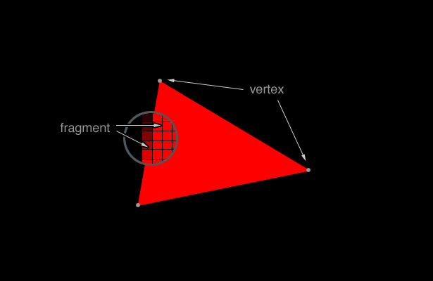

#A DEVELOPER'S INTRO TO WEBGL

Recently, I have been starting to get to grips with WebGL. Having little to no real previous experience with 3D graphics, there was a reasonably steep learning curve to overcome. So I thought I'd touch on a few of the basics here and share some resources that I found really useful.
##WegGL Overview
WebGL is a JavaScript API that allows for the rendering of 3D graphics within the browser. It renders on a <code>&lt;canvas&gt;</code> element as a drawing context, but provides low-level access to the GPU. The graphics can be made completely interactive; responding to keyboard and mouse events, as well as touch events on mobile devices.

There are tons of great resources out there to introduce the key concepts behind WebGl and 3D graphics in general. I found Luz Caballero's [introduction to WebGL]( http://dev.opera.com/articles/view/an-introduction-to-webgl/) particularly helpful in getting my head around precisely what is going on behind the scenes of all those amazing [WebGL examples](http://www.chromeexperiments.com/webgl/) on the web. 

Basically, all 3D graphics in WebGL are made up of vertices and fragments. Vertices are what you might expect; points with x, y and z coordinates defining their position. Fragments are essentially all of the pixels within triangles of vertices.

So, to render a 3D image with webGL, we essentially build up the image out of triangles. We tell webGL where we want each vertex, how we want the vertices to be connected into triangles, and how we want both the vertices and the fragments between them to be shaded. Greggman on github has some [nice animations]( http://greggman.github.io/webgl-fundamentals/webgl/lessons/webgl-how-it-works.html) to help visualise how vertices and fragments are processed and drawn.

There’s a whole lot more to it than that, of course. So please check out some of the links throughout this post to get a more detailed explanation. You could also read the [WebGL specification]( http://www.khronos.org/registry/webgl/specs/latest/1.0/), if you want a **really detailed** explanation.
##WebGL Libraries
So we’ve **very** briefly covered how WebGL 3D graphics are created. Which may seem simple enough, but it involves several quite mathematical, and perhaps not particularly intuitive steps. So how does that scale to rendering cubes, or spheres, or [aquariums]( https://webglsamples.googlecode.com/hg/aquarium/aquarium.html)? 

Short answer: a lot of hard work and usually the use of a library to abstract away some of the more tedious and repetitive tasks. This also has the pleasant side effect of making your code a little bit nicer, and a lot shorter.

Using libraries, you can go from painstakingly crafting spheres out of triangles to just calling a few simple methods. 
There are lots of WebGL libraries out there. A few worth looking at are:
*	[Three.js]( https://github.com/mrdoob/three.js#readme)
*	[PhiloGL]( http://www.senchalabs.org/philogl/)
*	[GLGE](http://www.glge.org/)

Check out [Paul Lewis’ tutorials]( http://www.aerotwist.com/) for more information on using libraries (Three.js  in this case).

##Spinning Squares and Triangles
For a far more detailed walkthrough the principles behind WebGL and creating your first 3D graphics, I strongly recommend Giles Thomas’ ["Learning WebGL"]( http://learningwebgl.com/blog/) blog. The lessons are adapted from a popular series based around game development in OpenGL, and they cover everything from spinning squares to nicely lit, interactive globes and more.
